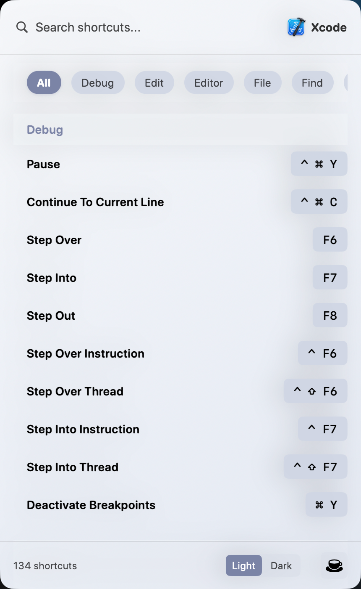
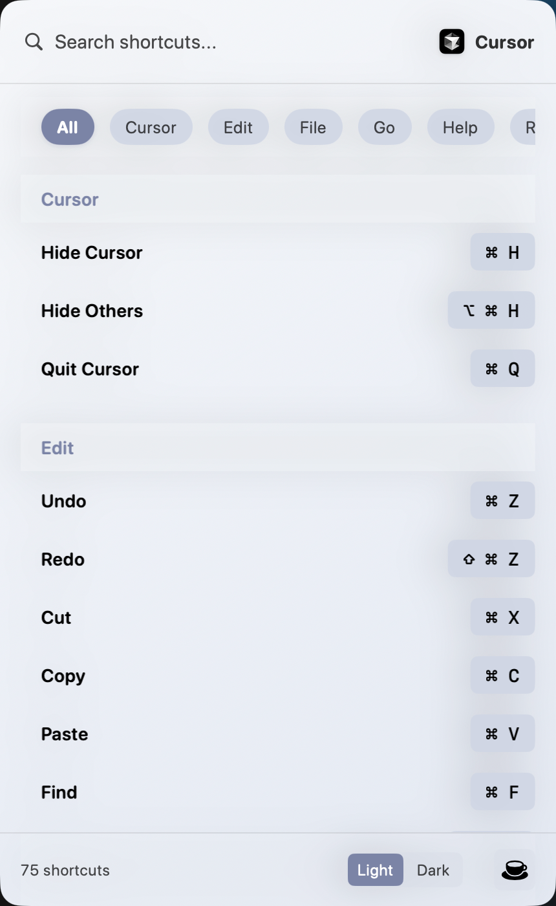

# KeyFlash

[English](#english) | [简体中文](#简体中文)

—

## English

KeyFlash is a lightweight menu bar utility for macOS that shows all available menu shortcuts of the current frontmost app. Double-press the trigger key (Command ⌘ by default) to reveal a sleek floating panel from the right side, grouped by menus with search and filters.

### Highlights
- Automatically extracts menu structure and shortcuts of the active app (powered by macOS Accessibility APIs)
- Elegant right-side sliding panel; grouped, searchable, and filterable
- Theme switching and multi-language localization
- Persistent menu bar item with actions: show panel, clear cache, launch at login
- Customizable trigger key: double-press ⌘ / ⌃ / ⌥ / fn

---

### 1) Requirements
- macOS 11.0+ (macOS 13+ recommended for a better Launch at Login experience)
- Accessibility permission is required to read menu items from other apps

---

### 2) Installation & Usage

#### Install
Option A — Download packaged app
1) Go to the project's `Releases` page and download the latest packaged `.app`.
2) Move the app to `Applications` and launch it.
3) On first launch, grant Accessibility permission when prompted.

Option B — Build from source
1) Open `KeyFlash.xcodeproj` in Xcode and select the `KeyFlash` scheme.
2) Build and run. On first launch, the app will request Accessibility permission.
3) Alternatively, use `KeyFlash/Support/BuildScripts/universal_build.sh` to build a universal binary (if configured).

#### First Run & Permission
- On first launch, follow the prompt and enable KeyFlash in System Settings → Privacy & Security → Accessibility.

#### Basic Usage
1) While any app is frontmost, double-press the trigger key (default Command ⌘ × 2).
2) The floating panel on the right shows all available shortcuts for the current app:
   - Search at the top
   - Horizontal category tabs
   - Only menu items with shortcuts are listed
3) From the menu bar icon you can:
   - Show panel, clear cache
   - Choose trigger key (⌘/⌃/⌥/fn)
   - Switch theme and language
   - Toggle Launch at Login and quit

Tip: Press ESC to close the panel. Double-press has a short cooldown to avoid accidental triggers.

---

### 3) Screenshots

| (Xcode) | Cursor |
| --- | --- |
|  |  |

---

### 3) Project Structure
```
KeyFlash/
  Core/
    Services/
      AccessibilityService.swift     # Permission checks, open settings, frontmost app
      EventMonitor.swift             # Keyboard/event monitoring (if used)
      MenuBarExtractor.swift         # Parse shortcuts from menu bar
  Data/
    DataSources/Local/ShortcutCache.swift
    Models/ShortcutModel.swift
    Repositories/ShortcutRepositoryImpl.swift
  Domain/
    Entities/                        # ApplicationEntity, MenuItemEntity
    UseCases/CaptureShortcutsUseCase.swift  # Capture flow and persistence
    Repositories/ShortcutRepository.swift   # Repository protocol
  Presentation/
    ShortcutViewer/Views/
      ShortcutsView.swift            # UI: search, categories, counters
      DraggableScrollView.swift
      ThemeSegmentControl.swift
    Views/SlidingPanelContainer.swift# Right-side sliding panel and window controller
    Utils/KeyCodeMapper.swift        # Key symbol mapping
  Utilities/
    AppSettingsManager.swift         # App settings init (theme/language/trigger)
    LocalizationManager.swift        # Localization
    ThemeManager.swift               # Theming
    TriggerKeyManager.swift          # Trigger key (⌘/⌃/⌥/fn)
  Support/
    BuildScripts/universal_build.sh  # Build script
    *.lproj/Localizable.strings      # Localized strings
  Assets.xcassets/                   # Icons and images (menu bar icon included)
  KeyFlashApp.swift                  # @main entry, status bar, global events, panel
  Info.plist / KeyFlash.entitlements # Permissions and configuration
```

Architecture notes:
- Domain-driven: `CaptureShortcutsUseCase` orchestrates → calls `MenuBarExtractor` → persists/loads via `ShortcutRepository` → notifies UI.
- `AppDelegate` manages the status bar item, double-press detection, and the panel lifecycle/state.

---

### 4) Buy Me a Coffee
If you find this project helpful, you can support it here:

- Link: `https://buymeacoffee.com/torreslol`
- You can also click the coffee cup icon in the menu bar panel.

Thanks for your support!

—

## 简体中文

一个专为 macOS 设计的菜单栏小工具，帮助你快速查看「当前前台应用」的所有菜单快捷键。双击触发键（默认 Command ⌘）即可在屏幕右侧弹出一个优雅的浮动面板，按分组展示并支持搜索过滤。

### 核心特性
- 自动捕获当前激活应用的菜单结构与快捷键（基于 macOS 辅助功能 API）
- 漂亮的右侧滑出面板展示，按菜单分组、可搜索、可筛选
- 支持主题切换与多语言本地化
- 菜单栏常驻，提供显示面板、清理缓存、开机自启等开关
- 可自定义触发键：⌘ / ⌃ / ⌥ / fn 的「双击」

---

### 1. 运行要求
- macOS 11.0+（建议 macOS 13+ 以获得更优开机自启体验）
- 需要开启「辅助功能」权限用于读取前台应用菜单

---

### 2. 安装和使用步骤

#### 安装
方案 A — 下载打包应用
1) 前往项目的 `Releases` 页面，下载最新打包的 `.app`。
2) 将应用拖拽到「应用程序」并启动。
3) 首次启动按提示授予「辅助功能」权限。

方案 B — 源码构建
1) 使用 Xcode 打开 `KeyFlash.xcodeproj`，选择 `KeyFlash` Scheme。
2) 直接运行构建（首次运行会请求辅助功能权限）。
3) 或使用脚本 `KeyFlash/Support/BuildScripts/universal_build.sh` 生成通用构建（如已配置）。

#### 首次运行与权限
- 首次启动会弹出授权说明，请前往「系统设置 → 隐私与安全性 → 辅助功能」勾选 KeyFlash。

#### 基本使用
1) 在任意应用前台，双击触发键（默认 Command ⌘ × 2）。
2) 右侧浮动面板将展示该应用的全部可用快捷键：
   - 顶部可搜索
   - 分类横向切换
   - 列表仅展示含快捷键的菜单项
3) 在菜单栏图标中可进行：
   - 显示面板、清理缓存
   - 设置触发键（⌘/⌃/⌥/fn）
   - 主题切换、语言切换
   - 开机自启开关、退出应用

提示：按 ESC 可关闭面板；再次双击触发键有显示冷却时间，避免误触。

---

### 3. 截图

| 面板（Xcode） | Cursor |
| --- | --- |
|  |  |

---

### 4. 项目结构
```
KeyFlash/
  Core/
    Services/
      AccessibilityService.swift     # 权限检测、系统偏好设置跳转、前台应用获取
      EventMonitor.swift             # 键盘/事件监控（若使用）
      MenuBarExtractor.swift         # 从菜单栏解析快捷键（提取逻辑）
  Data/
    DataSources/Local/ShortcutCache.swift
    Models/ShortcutModel.swift
    Repositories/ShortcutRepositoryImpl.swift
  Domain/
    Entities/                        # ApplicationEntity、MenuItemEntity 等领域模型
    UseCases/CaptureShortcutsUseCase.swift  # 捕获流程与持久化
    Repositories/ShortcutRepository.swift   # 仓库协议
  Presentation/
    ShortcutViewer/Views/
      ShortcutsView.swift            # 展示与交互（搜索、分类、统计）
      DraggableScrollView.swift
      ThemeSegmentControl.swift
    Views/SlidingPanelContainer.swift# 右侧滑出面板与窗口控制器
    Utils/KeyCodeMapper.swift        # 按键符号映射
  Utilities/
    AppSettingsManager.swift         # 应用设置（主题/语言/触发键初始化）
    LocalizationManager.swift        # 多语言
    ThemeManager.swift               # 主题与调色
    TriggerKeyManager.swift          # 触发键（⌘/⌃/⌥/fn）管理
  Support/
    BuildScripts/universal_build.sh  # 构建脚本
    *.lproj/Localizable.strings      # 多语言资源
  Assets.xcassets/                   # 图标与图片资源（含菜单栏图标）
  KeyFlashApp.swift                  # @main 入口，状态栏与全局事件、面板调度
  Info.plist / KeyFlash.entitlements # 权限与配置
```

架构要点：
- Domain 驱动，`CaptureShortcutsUseCase` 负责业务流程→调用 `MenuBarExtractor` 提取→通过 `ShortcutRepository` 持久化/读取缓存→通知 UI。
- `AppDelegate` 统一管理菜单栏项、全局触发键双击检测、面板显隐与状态同步。

---

### 5. Buy Me a Coffee
如果这个项目对你有帮助，欢迎请我喝杯咖啡：

- 链接：`https://buymeacoffee.com/torreslol`
- 菜单栏或面板右下角也可直接点击咖啡杯图标跳转。

感谢支持！